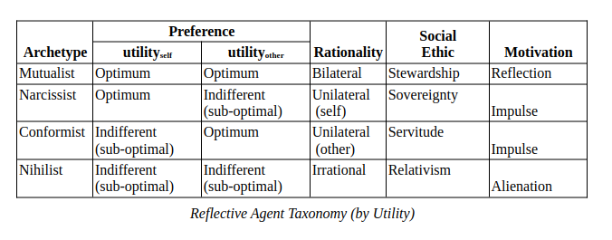

**Universal Agent Archetypes (UAA)**

Reflection, is the natural human ability to think and feel about how one
thinks and feels. Self-deception and self-awareness are the inversely
related internal manifestations of Reflection. Externally, one can
therefore think and feel about how others think and feel (empathy,
projection, etc.). This ability becomes fully developed at around 12
years of age (normal). All human adults (Agents) can therefore be
classified by this intrinsically “bilateral” mechanism into 4 distinct
strategy Archetypes.

The utility function (goal) in this taxonomy can be defined by narrative
and by formal Mechanism Design Theory (MDT). Mutualist Utility Function
(narrative form): Optimum of total aggregate utility with a
simultaneously optimum of equality (parity) of individual utility.
Mutualist Utility Function (MDT 2 x 2 ordinal form): u=((xi +
yi) + \|xi – yi\|)/2 : where xi
= Agent R utility ordinal (Narcissistic) and yi = Agent
C utility ordinal (Narcissistic).

A complete analysis reveals that only a 100% homogeneous population of
Mutualists can consistently produce and sustain optimal social systems
as the natural outcome. All other populations can only produce unstable,
sub-optimal systems. Since fictitious Agents (States, corporations,
etc.) are analogs (legal fictions) of actual humans, their strategic
Agency is also fully defined by this same taxonomy.

Ideally, an optimal political system exhibits 3 essential Quality of
Life characteristics. First, no individual can be made better off
without making someone else worse off. Second, everyone can’t be made
better off collectively (in total). Third, no one can be moved closer to
the optimum without moving someone else further away from it. All Agents
that aren’t true Mutualists would be required to consent to acting “as
if” they are one, in order to ensure optimization. Ideally, human
systems place only true Mutualists in control (leaders) positions within
the 3 domains of Social Power (Force, Wealth, Beliefs), because their
behavior would naturally serve Justice over Power.

There are subconscious motivations as well as conscious motivations.
They are driven by the subconscious Shadow. The Shadow is the deepest
part of the subconscious mind containing the Death Paranoia and Oneness
Rapture dichotomy, constituting the hidden foundation of all human
motivation, decisions, and actions. The 3 primitive Impulses: seeking
pleasure, avoiding pain, and conserving energy are the universal,
tactical motivators. Self-discipline: the inverse of the 3 Impulses, can
be realized through Reflection. It’s possible for any Archetype to
eventually become a true Mutualists through the practice of
self-discipline. The 4 Archetypes, The Shadow, the 3 Impulses, and
Reflection constitute the internal framework (first order) that
determines systemic outcomes \[What is internal is externalized, and
what is external is internalized\].
