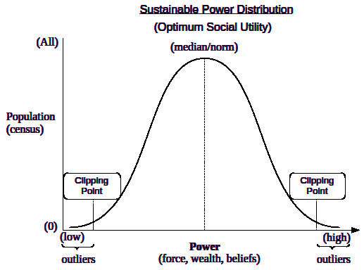

Universal Social Power

Social Power is intoxicating for humans, due to the way in which it can
induce an artificially inflated sense of self-importance and social
idolatry, for those who possess or control it. Everyone has an apatite
for it, but there’s an optimum amount and it’s easy to become insatiable
(addicted). The three domains of Power are all interrelated and any form
can easily be transformed into any of the other forms. Warfare is a
conflict arising from the quest to maintain or acquire Social Power in
any of the 3 domains (Force, Wealth, Belief). Only true Mutualists (see
Universal Agent Archetypes) are naturally capable of resisting this form
of corruption (addiction).

  

Rather than direct conflict to acquire or maintine Power, some form of Coercion is often committed. In many cases, there are multiple counts of Coercion committed.

  

Social Power systems require careful management in order to produce
optimal systemic consequences. A normal (Gaussian) distribution provides
the metrics for the outcomes of any given strategy.

  
