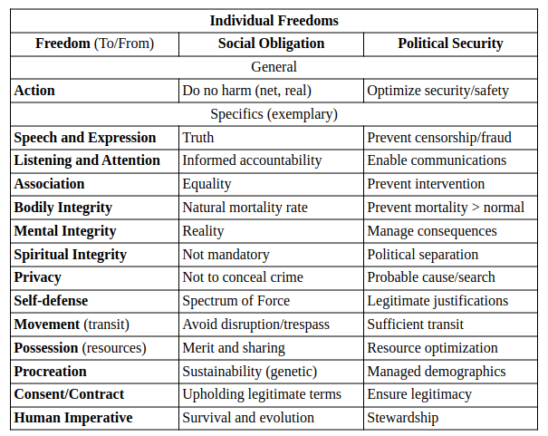
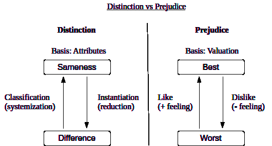
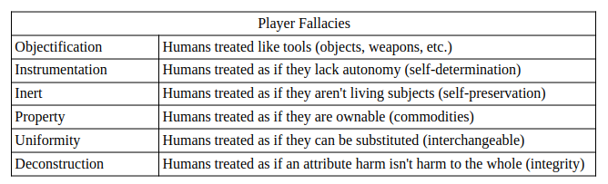

Universal Individual Freedoms

Autonomy is universally defined by the characteristic of self-directed
Power, Control and Freedom. For every Freedom there is an inherent
obligation to the political system to ensure justice. The General (meta)
principle is the “Action” item, which informs all other specific
freedoms.

  

  

  

  

Anyone (Player) who believes there is something superior to their own autonomy, has been brainwashed. An enabling factor is that
we all have the basic impulse to prefer comfort over freedom.
