Universal Social Organization

Freedom of Assembly naturally produces legitimate organizations
(congregations, etc.) of people, defined by the following
characteristics.

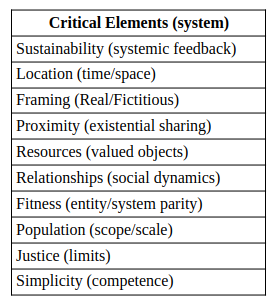  

Freedom of Assembly produces associations of people through commonality.
The level of social bonding (affinity) determines communal system
viability, sustainability and performance.

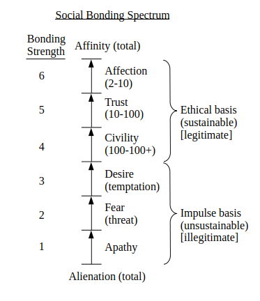  

Every entity (Player) has a consequential relationship with every System
as detailed in the Entity/System Relationship Spectrum.

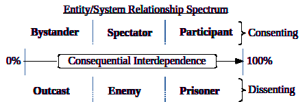  

Large systems are simply extensions of the underlying (atomic)
structures and dynamics.

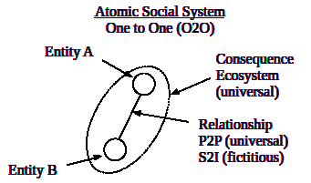  

  

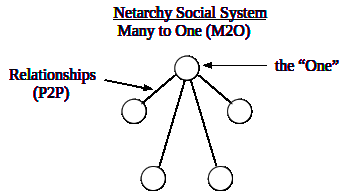  

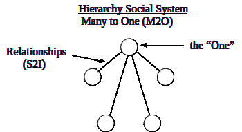  

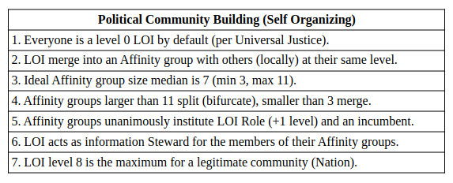  

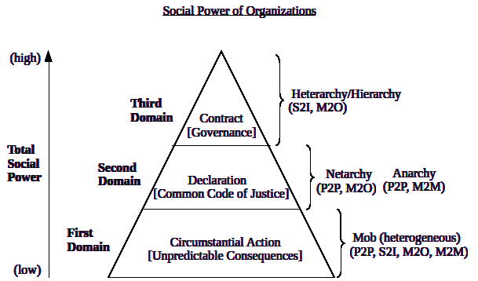  

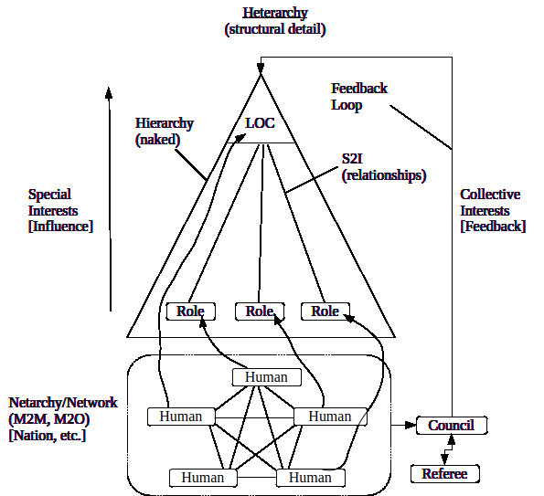  

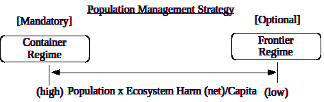  

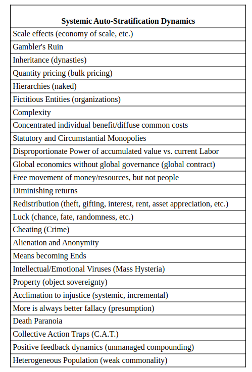  
