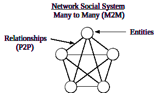

Universal Social Organization

Freedom of Assembly naturally produces legitimate organizations
(congregations, etc.) of people, defined by the following
characteristics.

  

Freedom of Assembly produces associations of people through commonality.
The level of social bonding (affinity) determines communal system
viability, sustainability and performance.

  

Every entity (Player) has a consequential relationship with every System
as detailed in the Entity/System Relationship Spectrum.

  

Large systems are simply extensions of the underlying (atomic)
structures and dynamics.

  

  

  

The process of community self-organizing ideally begins with a person in the role of "locus of information" (LOI) determining the strategy archetype of every candidate. This can easily be determined by asking if the candidate commits to serving Justice (Universal). If the answer is "yes" then they can be included in the process. If not, they are excluded.

  

  

  

Systems of social power inherently stratify due to many factors, unless they are specifically managed for optimization. These are the most common.

