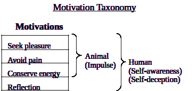
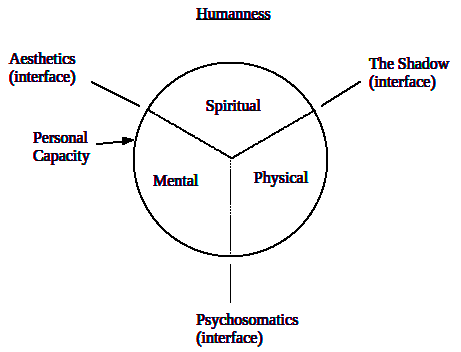

Universal Human Motivation

The Human Paradox: All humans are the same, and every individual is
unique. \[class/instance paradox\]

The Human Condition: Suffering (unsatisfied +/- wants), beyond one’s
ethical threshold, is the root of all destructive actions (crime, evil,
etc.), and the universal remedy is sufficient self-discipline.

Human Instincts: specific, universal, scalar motivations (impulses).
(Reproduction, Belonging, Curiosity, Territoriality, Security,
Sexuality, Survival, Solitude, Order, Valuation, Fun, Meaning, etc.)

Human Purpose: to fulfill one’s Humanness. \[overall well-being
of natural characteristics\]

The Shadow: epicenter for the deepest level of the subconscious,
which constitutes the foundation of all motivation \[Death Paranoia and
Oneness Rapture dichotomy\].

Personal Power: one’s actual level of fulfillment of humanness.

Justice (universal): motivation = Love (existential).  
Power: motivation = Fear (of dying).  
