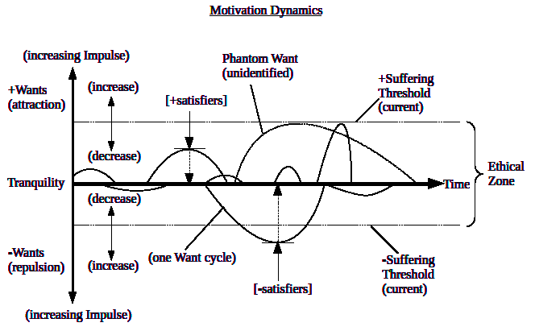
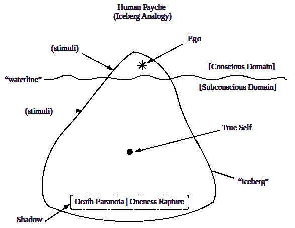

Universal Human Motivation

The Human Paradox: All humans are the same, and every individual is
unique. \[class/instance paradox\]

The Human Condition: Suffering (unsatisfied +/- wants), beyond one’s
ethical threshold, is the root of all destructive actions (crime, evil,
etc.), and the universal remedy is sufficient self-discipline.

Human Instincts: specific, universal, scalar motivations (impulses).
(Reproduction, Belonging, Curiosity, Territoriality, Security,
Sexuality, Survival, Solitude, Order, Valuation, Fun, Meaning, etc.)

Human Purpose: to fulfill one’s Humanness. \[overall well-being
of natural characteristics\]

The Shadow: epicenter for the deepest level of the subconscious,
which constitutes the foundation of all motivation \[Death Paranoia and
Oneness Rapture dichotomy\].

Personal Power: one’s actual level of fulfillment of humanness.

Justice (universal): motivation = Love (existential).  
Power: motivation = Fear (of dying).  

Motivation Dynamics arise from the nature of positive and negative wants, the ways in which they deviate from the line of tranquility, and the use of satisfiers to reduce the level of motivation back to the line of tranquility. There are many wants on the line of tranquility. Over time, under specific circunstances, a want can deviate from tranquility and motivate action. Extreme wants (outside of the ethical zone) produce extreme action. The ethical zone can be increased through the practices of self-discipline.

  

The complex nature of the human psyche can be compressed in a simple analogy.  

