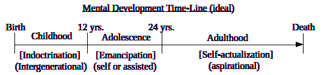

Universal Human Imperative

The universal principles defining a strategy and metrics for fulfilling
humanness. These ideals are aspirations, not expectations, and are
therefore most useful for setting the high bar.

Individual

Physical: to the best of one’s natural abilities. \[metric: Reproduction
(healthy)\]

1. perpetuate one’s (self/kin) healthy genes into the future, intact
for evolution, by accessing essential material resources.  
2. enable the future conditions necessary for one’s successors to do the
same.

Mental: to the best of one’s natural abilities. \[metric:
Self-actualization, individuation\]

1. achieve one’s highest level of mental health \[IQ, EQ\] (through
Purpose, Learning, Connection, Self-esteem, etc.).  
2. enable the future conditions necessary for one’s successors to do the
same.

Spiritual: to the best of one’s natural abilities. \[metric: Existential
Love\]

1. harmonize one’s subconscious relationship with Existence through
enlightenment practices (meditation, fasting, self-discipline, fun,
etc.).  
2. enable the future conditions necessary for one’s successors to do the
same.

Collective

Political: to the best of our abilities. \[Optimization\]

1. contribute to the most good (Quality of Life) for the most people
for the longest time.  
2. enable the future conditions necessary for successors to do the same.

Managing the development of human characteristics over time is generally
dependent upon the specific stage of life for the members within each
generation.

All of these dynamics can be managed through conscientious application
of the universal principles underlying optimization of Human Systems
(Optopian Strategy).

The cycle of Inter-generational Indoctrination is a specific form of
mass formation (hysteria), perpetuated through the common methods for
propaganda and brainwashing. The motivation for compliance arises from
wanting to belong (feels good), and it’s easier (surrender vs
resistance). The perpetual cycle of Inter-generational Indoctrination is
defined by 5 critical elements:

The cycle is inescapable (due to the nature of human development).

Everyone is indoctrinated (no public questioning, dissent, alternatives,
de-programming).

Everyone is obligated to indoctrinate their successors in the same way.

No one must realize they have been indoctrinated.  

Successors must continue the cycle with their own successors (no
dissent).
