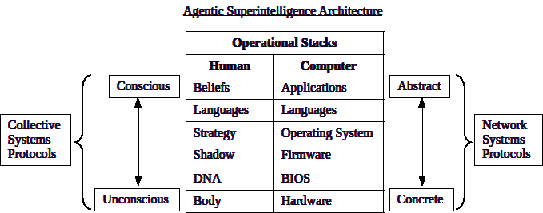

# optimizing-superintelligence-framework
Open source project to develop a universal Optimizing Superintelligence Framework (OSF)

A project to develop an OSF of the universal causal principles underlying all systems involving autonomous agents. The prime directive at the heart of the OSF is "optimize everything" (systemic optimization).

All non-optimizing (suboptimal) frameworks are incapable of consistently and sustainably producing optimal systemic outcomes (even when intended). Those frameworks are a root cause of the "uncontrollability problem" (predatory agents) as a primary risk for superintelligence, and therefore excluded from consideration in this project.

This project references human systems in order to provide a concrete model for reverse engineering of superintelligence principles. Development of useful AGI/ASI agents requires a full understanding of human systems for training and testing purposes (metrics). All of the architecture source is written in multi-modal pseudocode (natural language). The pseudocode utilized in this project includes simple tables, matrices, lists, line graphics and text.

The project documentation is divided into specific sections, but all of them are interdependent with each other (unified). The top level design model is the Agentic Superintelligence Architecture (ASA), of which the OSF is the core component (reasoning engine). Agentic Systems are systems involving autonomous agents.  

To get up to speed quickly on this project, start with the core principles contained in the first 4 modules listed in the [INDEX](INDEX.md). The founding documents for this project were initially sourced from the TOR network in 2008.  

Communications can be directed to the project curator (gemigon at gmx dot com).
